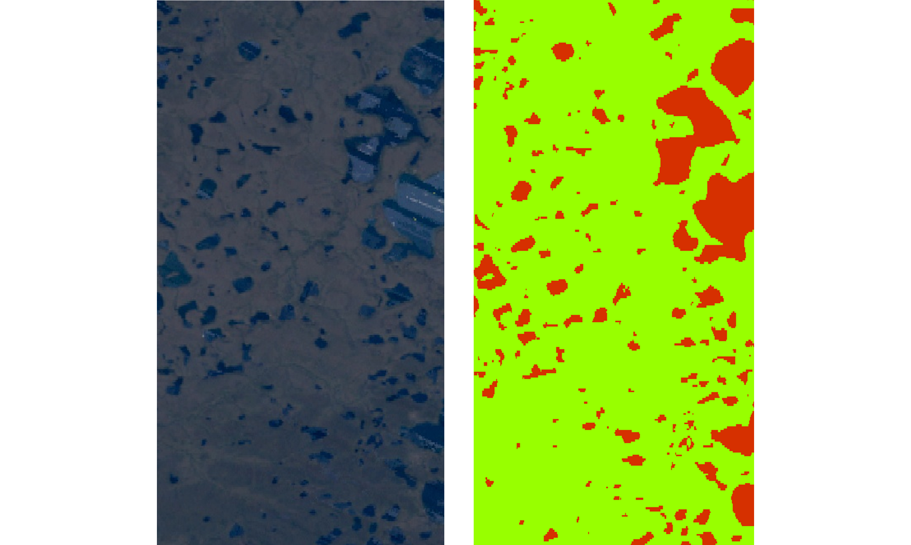
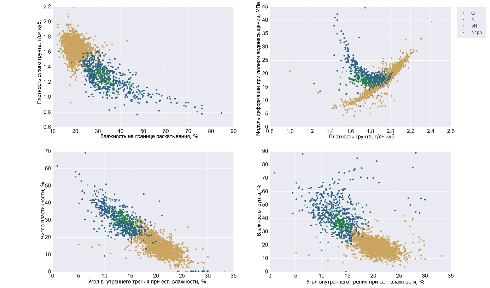

_Курс состоит из двух блоков:_
### 1. Анализ данных дистанционного зондирования Земли с помощью _Google Earth Engine_
**Вы узнаете:**
- Что такое облачные геоинформационные системы
- Что такое дистанционное зондирование Земли и его виды
- Что такое машинное обучение и как можно его использовать для сегментации объектов для данных дистанционного зондирования Земли
          
**Вы научитесь:**
- Производить анализ спектральных каналов спутниковой съемки
- Находить свежие и исторические данные спутниковой съемки, с учетом облачности территории, в пределах региона исследований
- Анализировать собственные векторые наборы данных и данные спутниковой съемки
- Использовать алгоритм на основе машинного обучения для автоматической сегментации и классификации объектов на спутниковых снимках

**Пример задачи: Автоматический анализ пораженности местности термокарстовыми озерами за заданный период года на основе машинного обучения**

### 2. Основы анализа данных в Python
**Вы узнаете:**
- Преимущество, удобство и гибкость анализа данных с помощью _Python_ в среде _IPython Jupyter Notebook_
- Современные пакеты для анализа данных _Numpy_, _Pandas_, _Matplotlib_, _Seaborn_ и др.
- Возможности и потенциал изученных инструментов для применениея в науках о земле и не только 

**Вы научитесь:**
- Делать описательный анализ данных
- Использовать инструменты для получения исчерпывающей статистики исследуемого массива данных
- Производить эффективную визуализацию анализа и получать из этого важную информацию

**Пример задачи: Анализ свойств грунтов на основе имеющихся данных**

